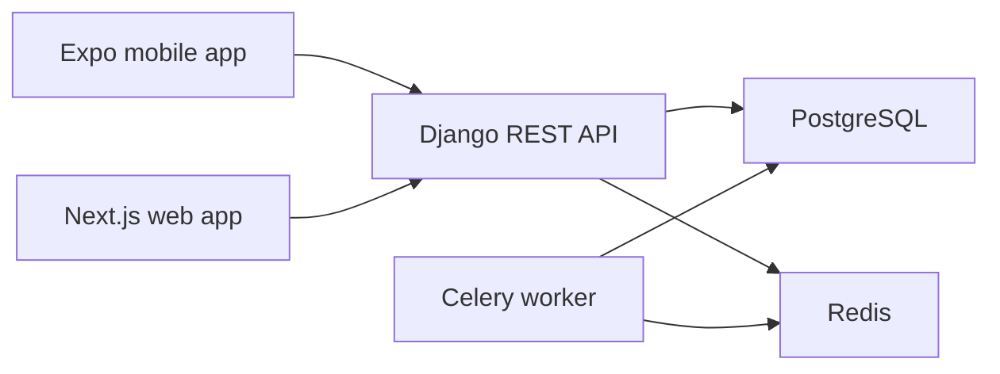

# PesaRoute Architecture

## Product Boundary

PesaRoute is a decision and education platform. It compares investment routes, runs educational simulations, checks scam red flags, stores a private journal, mirrors portfolios manually, and prepares for future verified professional review.

PesaRoute does not hold money, execute investments, recommend products, ask for M-Pesa PINs, collect bank passwords, or connect to live financial accounts in the MVP.

## System Shape

## Backend Domains

- `accounts`: default Django user plus role profile for consumer, professional, provider, and admin.
- `catalog`: categories, providers, product passports, and passport versions.
- `planning`: goals, route requests, route results, and educational simulation runs.
- `risk`: deterministic scam checks and red-flag records.
- `journal`: private decision journal with exact, rounded, range, or hidden amounts.
- `portfolio`: manually mirrored holdings and a summary endpoint.
- `marketplace`: professional, verification, and consultation placeholders.
- `privacy`: future time-limited data grants and data access logs.
- `audit`: important user and provider actions.

## Privacy Model

The MVP stores user-created journal and portfolio data privately. Exact values are optional. Future professional review must use explicit `DataGrant` records with start and expiry timestamps, revocation state, and access logs.

## API Style

The API uses Django REST Framework, JSON responses, validation serializers, pagination for lists, and per-view permissions for private placeholders. Public catalog endpoints are shaped for future caching.

## Data Stores

Local development defaults to SQLite when `DATABASE_URL` is not set. Docker Compose provides PostgreSQL and Redis, matching the intended stack. Celery is wired for future heavy jobs but has no production tasks yet.

## Audit Events

The MVP records audit events for journal creation, portfolio item creation, scam checks, and consultation requests. Product passport update audit logging should be attached when write/admin APIs are added.
